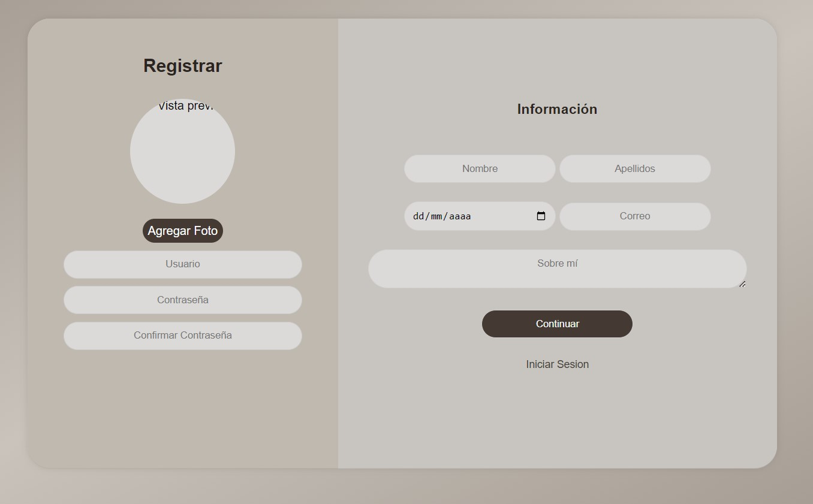
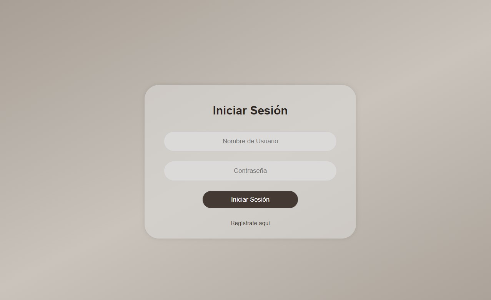
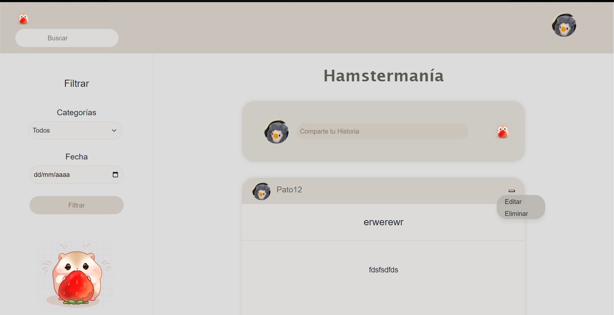
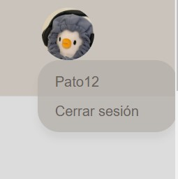
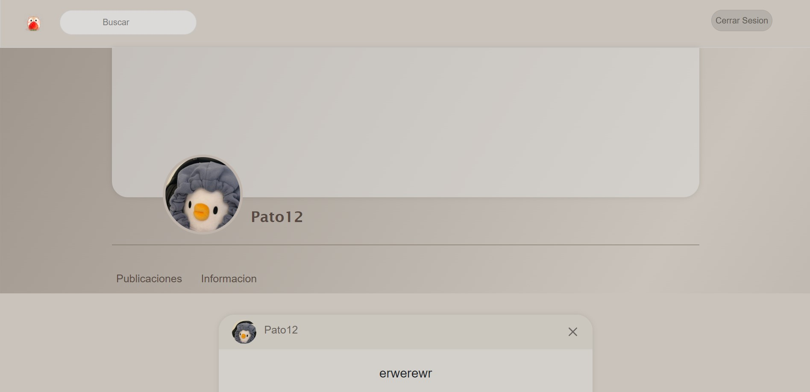
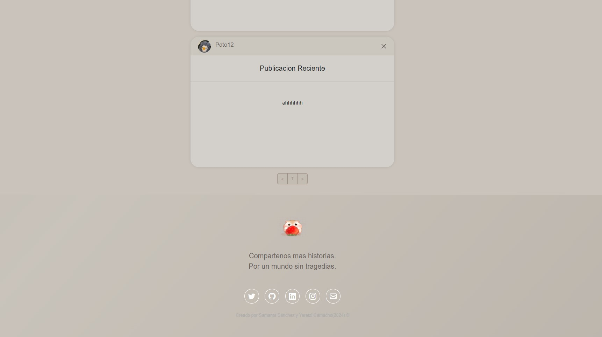
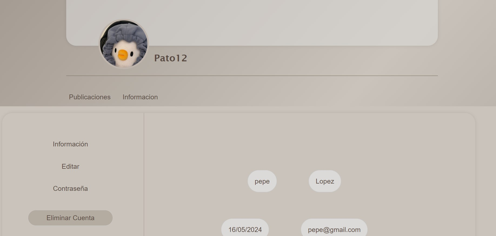
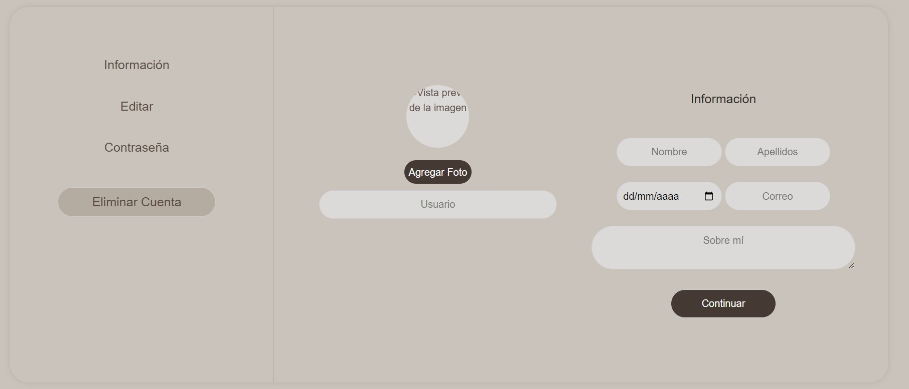
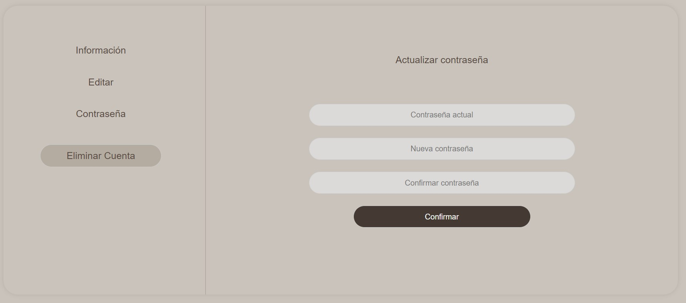
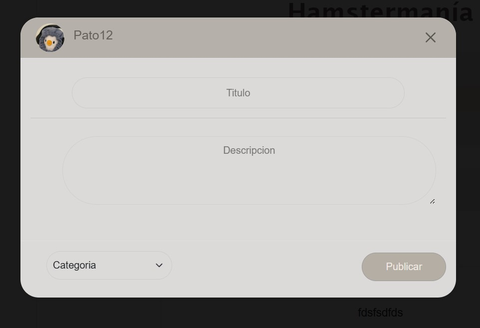

# Hamstermania

## INDICE

1. Proyecto
2. Objetivos
3. Capturas de Pantalla
4. Tecnologias 
5. Idioma

### Proyecto

Pagina web tipo blog con conexion a Mysql , se realizan publicaciones, las cuales se editan y eliminan, contiene perfil de usuario, con publicaciones e informaion del mismo.

### Objetivos

Desarrollo del lado del cliente, el cual incluye HTML, CSS y JavaScript.
Desarrollo del lado del servidor, el cual incluye Java y MySQL. 
Diseño funcional de la pagina web y validacion de lado del cliente y Ajax.

### Capturas de Pantalla

Pantallas de mi Pagina Web

### Tecnologias
Este proyecto fue realizado con:
* Java
* JavaScrip
* Html
* Css
* Mysql

### Idioma
Español.
